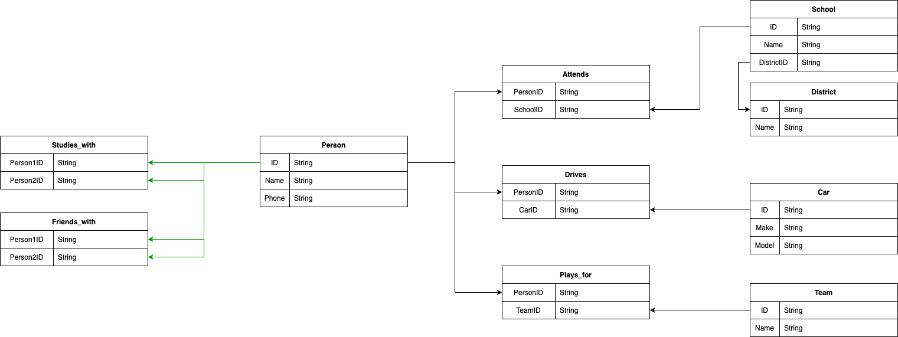

# legendary-parakeet

A repository to work with some graph data. The source code is located in the ```src``` folder. In a python Jupyter notebook called main.

## Running the application
----
In order to run the application, Docker and Docker-Compose is required. Once installed, you can run get the application started using the below command:
```bash
docker-compose up --build
```
Once both the notebooks and db containers are running, you can go to ```localhost:8888``` in your browser of choice. This should bring up jupyter. Open the notebook titled ```main``` and run all the cells sequentially.
</br></br>

## Part 1
----
</br>

#### Approach:

</br>

Due to time and experience constraints, I decided to go with a relational approach to this problem. The data and problem set was a great candidate for a graph database. However, the choice was made to go with a postgres database and model the data in 3NF as demonstrated above.
</br></br>
The data was ingested by reading and cleaning some text files that were given. They were mostly tab delimited but had some spaces thrown in to dirty the text. Fortunately, cleaning the data was as simple as applying the ```strip``` method to all the columns.
</br></br>
Once the data was cleaned, the method for ingesting the data was to gather all the unique entities in the given data. We could then gather all ID's by entity so that we know how to structure each group of ID's properly. Once the new entities were constructed and stored in their respective tables, we could then gather all the unique relationships. From there, we could create the relationships given.
</br></br>

#### Scaling:
The size of the data used in this notebook was very small. In a larger, production setting, this ingestion approach would need to scale. In order to do this, a big data tool would almost certainly be required. My tool of choice for this would be Apache Spark (preferrably on Databricks). The ingestion and modeling approach could largely stay the same and work.
</br></br>
If one were to explore possible enhancements to this system, I would highly recommend looking into using semantic technologies. Building out a proper ontology and later a knowledge graph could help gain further insights. If not, considering and doing a Proof of Concept (PoC) of a graph database would be a very good choice.
</br></br>

## Part 2: Option 1
----
</br>

#### Approach:
</br>
When visualizing the graph of people who are friends with each other, it was clear that there were no cliques of friends that was larger than 2 people. To make this exercise more interesting, people who study with each other were also included in the graph. This created a clique of three individuals.
</br></br>
In order to find the cliques of individuals in this graph, an edgelist was created where one person was the source and the other was the target. This edgelist was passed into the python library called networkx. This library also includes a function to find all the (maximal) cliques. As one can see at the end of the notebook, one of the lines of contains a list of three nodes.
</br></br>

#### Scaling:
</br>
Scaling clique finding is an interesting problem that I have not yet encountered in my professional experience. If I were to scale this problem, one way of doing it would be to use GraphFrames in Pyspark. This is one of the main ways to tackle graph problems in spark. Of course, there might be another way to do this with a graph database (or even a combination).
</br></br>